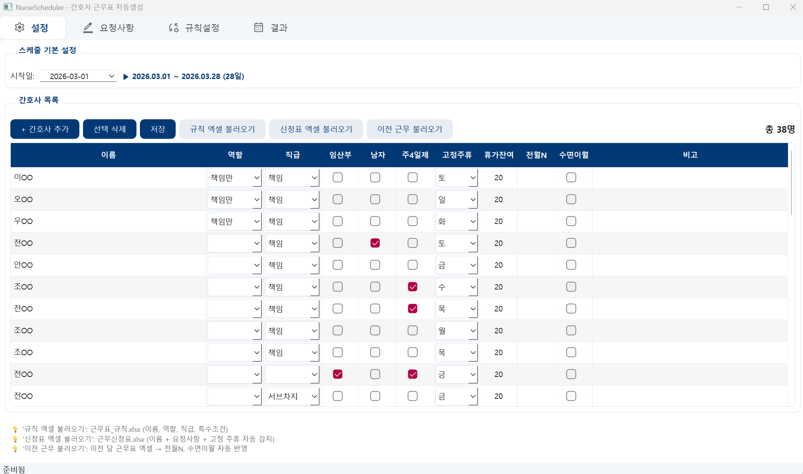
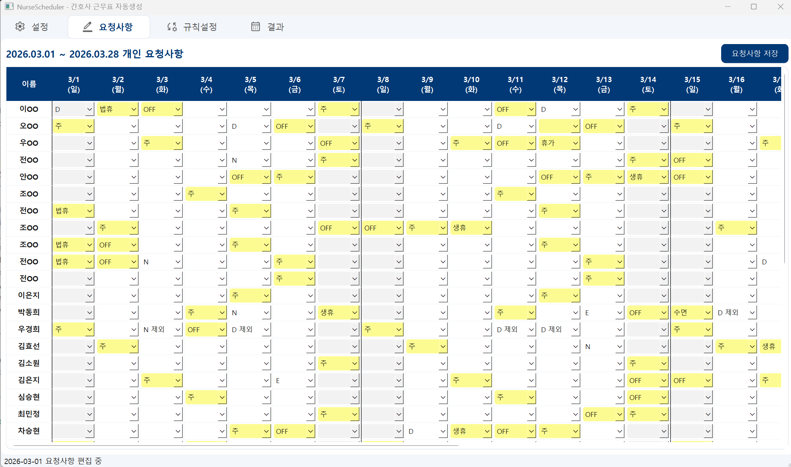
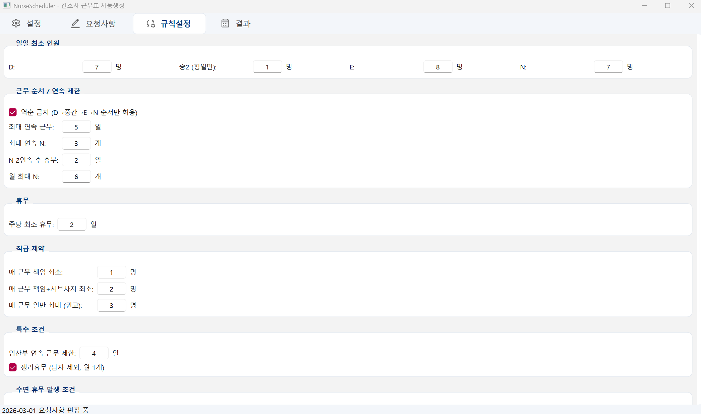
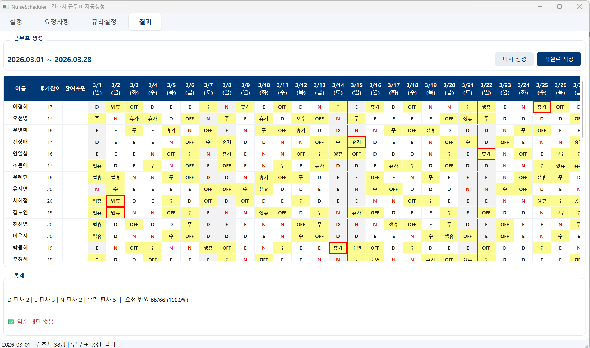

# NurseScheduler — 응급실 간호사 근무표 자동생성

OR-Tools CP-SAT 솔버 기반 제약조건 최적화 + PyQt6 데스크톱 앱

---

## 주요 기능

| 기능 | 설명 |
|------|------|
| 자동 근무표 생성 | 7종 근무(D/D9/D1/중1/중2/E/N) + 14종 휴무를 월 단위로 자동 배정 |
| 하드 제약조건 | 일일 인원, 역순 금지, 연속근무 제한, 직급/역할 요구 등 20개 |
| 소프트 목적함수 | D/E/N 공정성, 야간 균등, 주말 균등, 요청 반영률 등 5개 |
| 요청사항 실시간 검증 | 입력 즉시 19종 규칙 위반 차단 (역순·연속·NN패턴·OFF초과 등) |
| 생성 전 사전 검증 | 근무표 생성 버튼 클릭 시 요청사항 전체 재검증 후 경고 표시 |
| 수동 수정 | 생성된 근무표를 셀 단위로 편집 (16종 위반 실시간 체크) |
| 엑셀 연동 | 규칙 엑셀·신청표·이전 근무표 가져오기 / 근무표·통계 내보내기 |
| 공정성 평가 | A~F 등급, 편차·위반 항목별 상세 표시 |
| 자동 백업 | JSON 데이터 `~/Documents/NurseScheduler_backup/` 자동 저장 |

---

## 실행 방법

```bash
# 의존성 설치 (uv 패키지 매니저 사용)
uv sync

# 앱 실행
uv run python main.py

# Windows 독립 실행 파일(.exe) 빌드
build.bat
```

**요구사항**: Python 3.12+ · PyQt6 · ortools · openpyxl

---

## 근무/휴무 코드

| 구분 | 코드 |
|------|------|
| 근무 (자동배정) | `D` (주간) · `E` (저녁) · `N` (야간) · `중2` (중간근무, 평일 전용, role "중2"만) |
| 근무 (입력 전용) | `D9` · `D1` · `중1` — 요청 시에만 배정, 솔버 자동배정 없음 |
| 휴무 | `주` · `OFF` · `POFF` · `법휴` · `수면` · `생휴` · `휴가` · `병가` · `특휴` · `공가` · `경가` · `보수` · `필수` · `번표` |
| 요청 제외 | `D 제외` · `E 제외` · `N 제외` |

---

## 사용 흐름

###  1단계 · 설정 탭

간호사 목록을 등록합니다.

| 항목 | 설명 |
|------|------|
| 이름 | 간호사 이름 (필수) |
| 역할(비고1) | 책임만·외상·혼자관찰·급성구역·준급성·격리구역·중2 등 |
| 직급(비고2) | 책임·서브차지 — D/E/N 시간대별 최소 인원 체크에 사용 |
| 임산부 | 연속 근무 4일 초과 제한 + 4근무마다 POFF 1일 자동 배정 |
| 주4일제 | 주당 OFF 2개 적용 |
| 고정주휴 | 매주 특정 요일 고정 휴무 배정 |
| 휴가잔여 | 이번 달 사용 가능한 잔여 휴가 일수 |
| 전월N / 수면이월 | 수면 발생 계산 기준 — **이전 근무 불러오기** 사용 권장 |

엑셀 파일(`근무표_규칙.xlsx`) 또는 이전 근무표에서 한 번에 불러올 수 있습니다.



---

###  2단계 · 요청사항 탭

간호사별 × 날짜별 콤보박스 격자에서 근무 희망, 휴무 요청, 제외 요청을 입력합니다.

입력 즉시 아래 규칙을 실시간으로 검증하여 위반 시 자동 차단합니다.

| 검증 항목 | 내용 |
|----------|------|
| 역순 배치 | D→E→N 순서 역전 금지 |
| N 후 패턴 | N→1휴무→D/중간 금지, N 다음날 보수/필수/번표 금지 |
| NN 후 2일 휴무 | 연속 N 2개 이후 근무 2일 이내 배치 금지 |
| 연속 근무 초과 | 최대 연속 근무일 초과 요청 금지 |
| 연속 N 초과 | 최대 연속 야간 초과 요청 금지 |
| 월 N 상한 | 월 최대 N 횟수 초과 요청 금지 |
| OFF 주당 초과 | 일반 주당 1개 / 주4일제 2개 초과 금지 |
| 주 요일 제한 | 고정 주휴일 외 `주` 입력 차단 |
| 법휴 공휴일 | 공휴일 아닌 날 법휴 입력 차단 |
| 생휴 | 남자 불가, 여성 월 1회 한도 |
| POFF | 임산부만 신청 가능 |
| 중2 | role "중2"만 가능, 주말 입력 차단 |
| 고정주휴 근무 | 고정 주휴일에 근무 요청 차단 |



---

###  3단계 · 규칙설정 탭

일일 최소 인원, 근무 순서·연속 제한, 직급 조건, 임산부·생리휴무 특칙, 수면 발생 기준, 법정 공휴일 등을 설정합니다.

| 항목 | 기본값 |
|------|--------|
| 일일 D / E / N 인원 | 7 / 8 / 7 |
| 일일 중2 인원 (평일) | 1 |
| 월 최대 N | 6 |
| 최대 연속 N | 3 |
| 최대 연속 근무 | 5 |
| 수면 발생 기준 (월별) | N ≥ 7 |
| 수면 발생 기준 (2개월) | 전월N + 당월N ≥ 11 |



---

###  4단계 · 결과 탭

**근무표 생성** 버튼 클릭 시:
1. 요청사항 전체 재검증 → 문제 발견 시 경고 목록 표시 (계속 진행 여부 선택)
2. OR-Tools CP-SAT 솔버 실행 (기본 타임아웃 180초)
3. 색상 코딩된 결과 표시

| 색상 | 의미 |
|------|------|
| 노란 배경 | 요청 반영됨 |
| 흰 배경 + 빨간 테두리 | 요청 미반영 (툴팁으로 원래 요청 표시) |
| 회색 배경 | 주말 |
| 빨간 글자 | 야간(N) 근무 |



셀 직접 수정 시 16종 위반 실시간 체크 → **엑셀 내보내기**.
하단에는 근무별 집계, 불량 패턴 감지, 위반 상세, 간호사별 통계(D/E/N 편차·요청 반영률·잔여휴가·잔여수면)가 표시됩니다.

---

## 프로젝트 구조

```
nurse-scheduler/
├── main.py                  ← 실행 진입점
├── engine/                  ← 백엔드 (UI 의존 없음)
│   ├── models.py            ← 데이터 클래스 (Nurse, Request, Rules, Schedule) + JSON 저장/백업
│   ├── solver.py            ← OR-Tools CP-SAT 솔버 (NUM_TYPES=21, 4 workers, 기본 180s timeout)
│   ├── validator.py         ← 수동 수정 시 16종 위반 체크
│   ├── evaluator.py         ← 공정성 평가 (0-100점, A-F 등급)
│   └── excel_io.py          ← 엑셀 가져오기/내보내기
├── ui/                      ← PyQt6 뷰 (탭 1개 = 파일 1개)
│   ├── styles.py            ← SHIFT_COLORS, 앱 스타일시트
│   ├── main_window.py       ← 4탭 메인 윈도우 + 가이드 패널 토글
│   ├── guide_panel.py       ← 탭별 맥락 도움말 사이드 패널
│   ├── setup_tab.py         ← Tab 1: 간호사 관리
│   ├── request_tab.py       ← Tab 2: 요청사항 달력 + 실시간 검증
│   ├── rules_tab.py         ← Tab 3: 규칙 설정
│   └── result_tab.py        ← Tab 4: 결과 표시 + 수동 수정 + 통계
├── assets/
│   ├── logo.ico             ← 앱 아이콘
│   └── icons/               ← 탭 아이콘 (SVG)
├── data/                    ← JSON 저장 파일 (nurses, rules, requests, schedule)
├── build.bat                ← PyInstaller 빌드 스크립트
└── CLAUDE.md                ← Claude Code 개발 가이드
```

---

## 솔버 개요

- **변수**: `shifts[(nurse_idx, day_idx, shift_idx)]` BoolVar — 21종
  `D=0 · 중2=1 · E=2 · N=3 · 주=4 · OFF=5 · 법휴=6 · 수면=7 · 생휴=8 · 휴가=9 · … · D9=18 · D1=19 · 중1=20`
- **하드 제약**: 역순 근무 금지, 연속 근무/야간 제한, NN 후 2일 오프, 월간 N 상한, 주간 오프, 일일 인원/직급/역할 요구, 임산부·주4일 특칙 등
- **소프트 목적함수**: D/E/N 총량 편차 최소화, 야간 균등, 주말 균등, 요청 반영률 최대화
- **수면 오프**: 2개월 고정 쌍(`(1,2)`, `(3,4)`, …) 기준, 홀수 월 미발생분은 `pending_sleep`으로 이월

---

## 데이터 흐름

```
SetupTab (간호사·연월)
    ↓
RequestTab (요청사항 입력 + 실시간 19종 검증)
    ↓
ResultTab → validate_requests() 사전 검증 → solver.solve_schedule() → Schedule
    ↓
수동 수정 → validator.validate_change()
    ↓
evaluator.evaluate_schedule() → 공정성 등급/상세
    ↓
excel_io.export_schedule() → .xlsx
```
