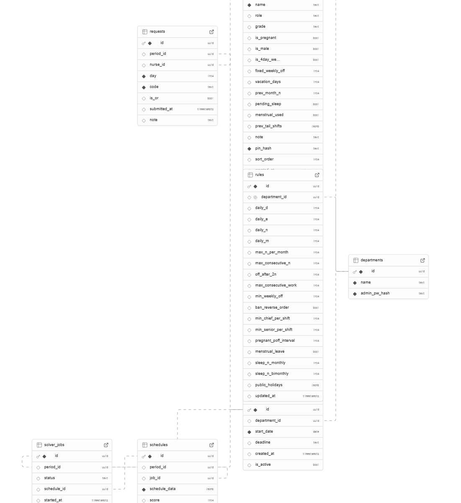

# NurseScheduler — 응급실 간호사 근무표 자동생성

OR-Tools CP-SAT 솔버 기반 제약조건 최적화 · FastAPI 백엔드 + React 웹 프론트엔드

---

## 주요 기능

| 기능 | 설명 |
|------|------|
| 자동 근무표 생성 | 7종 근무(D/D9/D1/중1/중2/E/N) + 14종 휴무를 28일 단위로 자동 배정 |
| 하드 제약조건 20+ | 일일 인원, 역순 금지, 연속근무·야간 제한, NN 후 오프, 직급/역할 요구 등 |
| 소프트 목적함수 | 요청 반영, D/E/N·주말 균등, N 연속 배정 선호 등 6개 항목 |
| 간호사 근무 신청 | 웹 달력으로 근무/휴무 신청, 규칙 위반 실시간 검증 |
| 관리자 대시보드 | 신청현황 열람·편집, 근무표 생성·수정·평가, 엑셀 내보내기 |
| 이름·날짜 필터 | 신청현황·근무표 탭에서 이름 체크박스 + 날짜별 근무 종류 필터링 (엑셀 필터 방식) |
| 공정성 평가 | A~F 등급, 편차·위반 항목별 상세 표시 |
| 엑셀 연동 | 신청현황 내보내기 / 근무표+통계 내보내기 / 이전 근무표 가져오기 |
| 엑셀 통계 컬럼 | 총근무 · D · 중2 · E · N · OFF · 휴가 · 생휴 · 수면 · 법휴 · 공가 · 경가 · 보수 · 필수 · 잔여수면 · 잔여휴가 |

---

## 기술 스택

| 영역 | 사용 기술 |
|------|----------|
| 백엔드 | Python 3.12+ · FastAPI · Supabase (PostgreSQL) |
| 솔버 | Google OR-Tools CP-SAT |
| 프론트엔드 | React 18 · Vite · Tailwind CSS · Pretendard 폰트 |
| 엑셀 | openpyxl · msoffcrypto-tool |
| 공휴일 | holidays 패키지 (한국어 이름 자동 감지) |

---

## 실행 방법

### 백엔드

```bash
cd backend
pip install -r requirements.txt   # 또는 uv sync
uvicorn main:app --reload
```

### 프론트엔드

```bash
cd frontend
npm install
npm run dev
```

**환경변수** (`.env`):
```
SUPABASE_URL=...
SUPABASE_KEY=...
DEPARTMENT_ID=...
ADMIN_PASSWORD=...
```

---

## 근무/휴무 코드

| 구분 | 코드 |
|------|------|
| 근무 (자동배정) | `D` · `E` · `N` · `중2` (평일 전용, role "중2"만) |
| 근무 (입력 전용) | `D9` · `D1` · `중1` — 요청 시에만 배정 |
| 휴무 | `주` · `OFF` · `POFF` · `법휴` · `수면` · `생휴` · `휴가` · `병가` · `특휴` · `공가` · `경가` · `보수` · `필수` · `번표` |
| 요청 제외 | `D 제외` · `E 제외` · `N 제외` |

---

## 사용 흐름

### 간호사

1. 랜딩 페이지 → **근무 신청하기** → 이름/PIN 로그인
2. 일요일 시작 4주 달력에서 날짜 탭 → 근무/휴무 선택
3. 규칙 위반 실시간 감지 → **신청 제출하기**

### 관리자

1. 랜딩 페이지 → **관리자** → 비밀번호 로그인
2. **설정 탭**: 근무 기간·마감일 설정, 규칙(인원·제한·공휴일 등) 저장
3. **간호사 탭**: 간호사 등록·편집, 이전 근무표 업로드로 전월N·수면이월 자동 반영
4. **신청현황 탭**: 제출 현황 모니터링, 셀 직접 편집, 엑셀 저장
5. **근무표 탭**: **생성** → CP-SAT 솔버 실행 → 결과 확인·수동 편집 → **평가** → **엑셀** 내보내기

---

## 프로젝트 구조

```
nurse-scheduler/
├── engine/                  ← 솔버·검증·평가 (UI 의존 없음)
│   ├── models.py            ← 데이터 클래스 (Nurse, Request, Rules, Schedule)
│   ├── solver.py            ← OR-Tools CP-SAT 솔버 (NUM_TYPES=21, 소프트 제약 S1~S6)
│   ├── validator.py         ← 수동 수정 시 위반 체크
│   ├── evaluator.py         ← 공정성 평가 (0-100점, A-F 등급)
│   ├── excel_io.py          ← 엑셀 가져오기/내보내기
│   └── kr_holidays.py       ← 한국 법정공휴일 조회 (holidays 패키지)
├── backend/                 ← FastAPI 서버
│   ├── main.py              ← 앱 진입점, CORS, 기간 자동 정리
│   ├── database.py          ← Supabase 클라이언트
│   ├── config.py            ← 환경변수 설정
│   └── routers/             ← API 라우터
│       ├── auth.py          ← 간호사/관리자 인증
│       ├── nurses.py        ← 간호사 CRUD + 이전 근무표 업로드
│       ├── rules.py         ← 규칙 설정
│       ├── settings.py      ← 기간·마감일 설정
│       ├── requests.py      ← 근무 신청 CRUD
│       ├── schedule.py      ← 근무표 생성(비동기 Job) + 수정
│       ├── export.py        ← 엑셀 스트리밍 다운로드
│       └── holidays.py      ← 공휴일 조회 API
└── frontend/                ← React 웹 앱
    └── src/
        ├── pages/
        │   ├── LandingPage.jsx          ← 메인 진입 화면
        │   ├── NurseAuthPage.jsx        ← 간호사 로그인
        │   ├── NursePage.jsx            ← 간호사 근무 신청 달력
        │   └── admin/
        │       ├── AdminAuthPage.jsx    ← 관리자 로그인
        │       ├── AdminLayout.jsx      ← 4탭 레이아웃
        │       ├── SettingsTab.jsx      ← 기간·규칙 설정
        │       ├── NurseManagementTab.jsx ← 간호사 관리
        │       ├── SubmissionsTab.jsx   ← 신청현황
        │       └── ScheduleResultTab.jsx ← 근무표 생성·편집·평가
        ├── components/
        │   ├── NameFilter.jsx           ← 이름 필터 드롭다운 (체크박스, 엑셀 필터 방식)
        │   ├── ShiftSheet.jsx           ← 근무 시트 컴포넌트
        │   └── PinModal.jsx             ← PIN 입력 모달
        ├── api/client.js                ← Axios API 클라이언트
        ├── store/auth.js                ← Zustand 인증 상태
        └── utils/
            ├── constants.js             ← 근무 색상·코드 정의
            └── validate.js              ← 규칙 위반 검증
```

---

## DB 스키마


> `schedule_data`: `{ "nurse_uuid": { "1": "D", "2": "N", … } }` 형태의 JSONB.
> `requests.code`: `D`, `E`, `N`, `OFF`, `휴가`, `D 제외` 등 근무/휴무/제외 코드.
> `periods.deadline`: `"YYYY-MM-DDTHH:MM"` 또는 `"YYYY-MM-DD"` 형식의 TEXT.
> `rules`는 부서당 1행 (upsert).
> 관리자 비밀번호는 `departments.admin_pw_hash`에 bcrypt 해시로 저장.

---

## 솔버 개요

### 알고리즘

Google OR-Tools **CP-SAT** (Constraint Programming + SAT) 솔버를 사용합니다.
순수 정수계획법(ILP)과 달리 논리 제약과 수치 제약을 함께 처리하며, 스케줄링 특화 휴리스틱으로 빠르게 해를 탐색합니다.
기본 타임아웃 300초 · 4 workers 병렬 탐색.

### 변수

```
shifts[(nurse_idx, day_idx, shift_idx)]  →  BoolVar (0 or 1)
```

28일 × 간호사 수 × 21종 의 BoolVar를 생성하고, 각 (간호사, 날짜) 쌍에서 정확히 1개만 1이 되도록 제약합니다.

| 인덱스 | 코드 | 비고 |
|--------|------|------|
| 0 | D | 주간 근무 (자동배정) |
| 1 | 중2 | 중간근무 — 평일 전용, role "중2"만 가능 |
| 2 | E | 저녁 근무 (자동배정) |
| 3 | N | 야간 근무 (자동배정) |
| 4 | 주 | 고정 주휴 |
| 5 | OFF | 일반 휴무 |
| 6 | 법휴 | 법정공휴일 휴무 |
| 7 | 수면 | 수면 휴무 |
| 8 | 생휴 | 생리 휴무 |
| 9 | 휴가 | 연차 휴가 |
| 10 | 특휴 | 특별 휴가 |
| 11 | 공가 | 공무 휴가 |
| 12 | 경가 | 경조사 휴가 |
| 13 | 보수 | 보수교육 |
| 14 | POFF | 임산부 추가 휴무 |
| 15 | 필수 | 필수교육 |
| 16 | 번표 | 번표 교환 |
| 17 | 병가 | 병가 |
| 18 | D9 | 입력 전용 (요청 있을 때만 배정) |
| 19 | D1 | 입력 전용 |
| 20 | 중1 | 입력 전용 |

### 배정 원칙

- D / E / N 인원은 **정확히** 규칙에 지정된 수 (`==` 제약)
- 나머지 인원은 솔버가 자동으로 휴무 배정 (타입도 솔버가 결정)
- 휴무 우선순위: `주` (1/주) → `OFF` (1/주) → `수면` → `생휴` → `휴가` (catch-all)
- **하드 코드**: 병가·번표·수면(명시 신청)·D9·D1 — 신청 시 반드시 배정
- **특휴·공가·경가·보수·필수**: soft, 신청한 날에만 배정 가능 (미신청 날 자동배정 없음)

### 하드 제약 (반드시 충족)

| 코드 | 내용 |
|------|------|
| H1 | 하루에 1개 근무/휴무만 배정 |
| H2 | 일일 D/E/N 인원 정확히 고정 |
| H2a | role "중2" 아닌 간호사는 중2 배정 불가 |
| H2b | D9/D1/중1은 하드 요청 없으면 자동배정 불가 |
| H3 | 역순 근무 금지 — D→중2→E→N 순서만 허용 |
| H3a | N 후 최소 2일 휴무 — N 다음 1휴무 뒤 D·중간근무 불가, E·N만 허용 |
| H3c | N 다음날 보수·필수·번표 금지 (실질 근무에 준하는 부담) |
| H4 | 최대 연속 근무일 제한 (기본 5일) |
| H5 | 최대 연속 N 제한 (기본 3회) |
| H6 | N 2연속 후 최소 2일 휴무 |
| H7 | 월 N 횟수 상한 (기본 6회) |
| H8 | 확정(하드) 요청은 해당 날짜에 직접 고정 |
| H9 | 제외 요청 (`D 제외` 등) — 해당 근무 배정 금지 |
| H10 | 고정 주휴 — 지정 요일마다 `주` 배정 |
| H10a | `주`는 고정 주휴일에만 배치 가능 |
| H10b | `법휴`는 법정공휴일에만 배치 가능 |
| H11 | 주당 OFF 정확히 1개 (주4일제 2개). 공휴일 주는 법휴가 대체 가능 (`OFF + 법휴 >= 1`) |
| H12 | 매 근무(D/E/N)에 책임간호사 최소 1명 |
| H13 | 매 근무에 책임+서브차지 합산 최소 N명 |
| H14 | 역할별 누적 인원 상한 (ROLE_TIERS 기준) |
| H15 | `책임만` 역할은 근무당 1명 이하 |
| H17 | 임산부 최대 연속 근무일 제한 |
| H18 | 공휴일 비근무 시 법휴만 허용 (고정주휴·하드요청 제외) |
| H19 | 임산부 4연속 근무 후 POFF 자동 배정 |
| H20 | 개인별 휴무 편차 제한 (일반 ±2, 주4일제 +4) |
| H21 | 신청 휴무 샌드위치 금지 — d일 휴무 신청 시 d-1·d+1이 모두 휴무면 d일도 반드시 휴무 |

### 소프트 목적함수 (maximize)

솔버는 아래 항들의 합을 최대화합니다. 우선순위: S1 > S1b > S6 > S3/S4 > S2 > S5

| 항목 | 가중치 | 설명 |
|------|--------|------|
| S1 희망 요청 반영 | **A: +800+score×5 / B: +250+score×5** | 간호사 근무·휴무 신청 반영. A조건 월 3개 제한. A 최저(800) > B 최고(750) 항상 보장 |
| S1a OR 요청 | 동일 공식 | `D/휴가` 형태 — 정확히 그 코드 배정 시에만 보상 |
| S1b 빈날 처리 | **+250** | 하드 휴무에 둘러싸인 빈날(휴가·?·휴가)에 OFF 배치 유도 |
| S2 D/E/N 공정성 | **-5**/편차 | 간호사 간 D·E·N 횟수 차이(max-min)에 페널티 |
| S3 N 균등 배분 | **-8**/편차 | N 횟수 편차에 추가 페널티 (S2보다 강하게) |
| S4 주말 균등 배분 | **-8**/편차 | 주말 근무 횟수 편차에 페널티 |
| S5 일반 쏠림 방지 | **-3**/초과 | 동일 근무에 일반 간호사가 기준 초과 시 페널티 |
| S6 N 연속 보상 | **+20**/쌍 | 인접 N-N 쌍마다 보상 → `N 휴무 N` 대신 `N N N` 블록 배정 유도 |

### 수면 휴무 계산

2개월 고정 쌍 `(1,2)`, `(3,4)`, `(5,6)`, … 기준으로 계산합니다.

- **당월 기준**: 당월 N ≥ `sleep_N_monthly` (기본 7) → 수면 1개 발생
- **2개월 합산**: 전월N + 당월N ≥ `sleep_N_bimonthly` (기본 11) → 짝수 월에 추가 발생
- 홀수 월에 발생했으나 미사용 시 → `pending_sleep`으로 다음 달 이월
